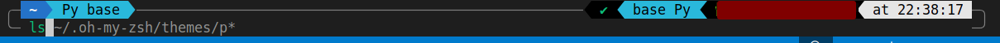

# my_dotfile
How to do it?
### download respond           plugin
#### 1. ensure you download the "zsh"
#### 2. clone this project
```
git clone git@github.com:only-tao/my_dotfile.git
```
then, link the zshrc and .p10k.zsh
```
ln -s ~/my_dotfile/zshrc ~/.zshrc

```
> p10k同样


#### 3. download the 3 plugin

autosuggestions
```
git clone https://github.com/zsh-users/zsh-autosuggestions $ZSH_CUSTOM/plugins/zsh-autosuggestions

```
zsh-syntax-highlighting
```
git clone https://github.com/zsh-users/zsh-syntax-highlighting.git $ZSH_CUSTOM/plugins/zsh-syntax-highlighting

```
powerlevel10k
```
git clone --depth=1 https://github.com/romkatv/powerlevel10k.git ${ZSH_CUSTOM:-$HOME/.oh-my-zsh/custom}/themes/powerlevel10k
```
### 启动
```
source ~/.zshrc
```
结果

### reference
https://zhuanlan.zhihu.com/p/583544542